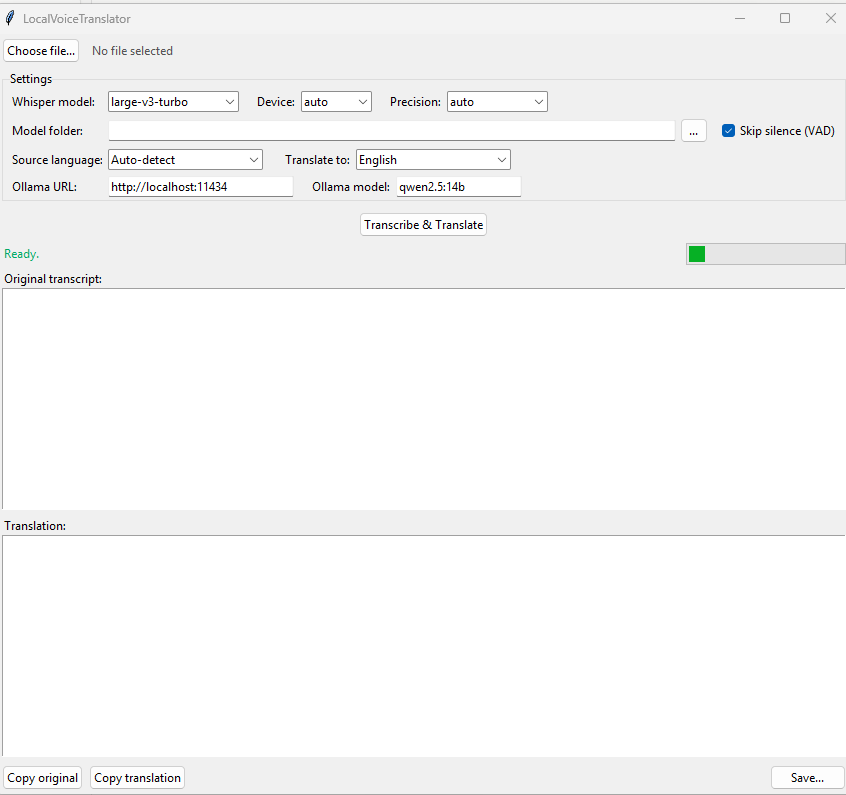

# LocalVoiceTranslator

Transcribe voice messages and other audio **locally** with [faster-whisper](https://github.com/SYSTRAN/faster-whisper) and translate them into 20+ languages with your own [Ollama](https://ollama.com) model. No cloud, no API keys, no admin rights. After the first model download everything works offline.

<!-- Screenshot: add docs/screenshot.png and uncomment

-->

## Features

- Speech-to-text with Whisper (`large-v3-turbo` by default), on an NVIDIA GPU or on the CPU
- Automatic fallback to CPU when the GPU is not usable
- Translation into 23 languages through any Ollama model, or transcription only
- Auto-detects the spoken language, or you pick it yourself
- Reads almost any audio format directly: `.ogg`/`.opus` (WhatsApp, Telegram), `.mp3`, `.m4a`, `.wav`, `.flac`, ...
- Copy or save the original and the translation as a text file

## Requirements

- **Windows 10/11** (the scripts are for Windows; the Python code itself also runs on Linux and macOS)
- **Python 3.10 – 3.14** from [python.org](https://www.python.org/downloads/). Tick **Add python.exe to PATH** during installation.
- **[Ollama](https://ollama.com/download)** with a multilingual model, for example:
  ```
  ollama pull qwen2.5:7b
  ```
  `qwen2.5:14b` gives better translations if you have the VRAM/RAM for it. Ollama may also run on another machine in your network.
- **Optional: an NVIDIA GPU** with a recent driver. No separate CUDA Toolkit is needed. Without a GPU the app uses the CPU, which is slower but works fine for short messages.

## Installation

1. Download this repository (**Code → Download ZIP**) and extract it to a folder you can write to, e.g. `C:\Users\<you>\LocalVoiceTranslator`.
2. Double-click **`setup.bat`**. It creates a virtual environment `venv` and installs the dependencies, including the CUDA libraries for the GPU (~1.5 GB download).
3. Optional: right-click **`create-shortcut.ps1`** → *Run with PowerShell* to get a desktop shortcut.

## Usage

1. Make sure Ollama is running.
2. Start the app with **`start.bat`** (or the desktop shortcut).
3. Choose an audio file, pick the source language (or *Auto-detect*) and the target language, and click **Transcribe & Translate**.

The first run downloads the Whisper model (~1.6 GB for `large-v3-turbo`, ~3 GB for `large-v3`) to `%USERPROFILE%\.cache\huggingface`, or to the *Model folder* you chose.

## Settings

All settings are saved in `localvoicetranslator_config.json` next to `app.py`. See [`localvoicetranslator_config.example.json`](localvoicetranslator_config.example.json) for all keys and defaults.

| Setting | Description |
|---|---|
| Whisper model | `large-v3-turbo` = fast and accurate (default). `large-v3` = slightly better, slower. `small`/`medium` for weak hardware. |
| Device | `auto` picks the GPU when available. `cpu` forces the CPU. |
| Precision | `auto` is fine in most cases. On the CPU `int8` is fastest. |
| Model folder | Empty = default Hugging Face cache. |
| Skip silence (VAD) | Skips silent parts: faster and fewer hallucinations. |
| Source language | *Auto-detect*, or force a language (more reliable for very short clips). |
| Translate to | Target language, or *None (transcribe only)*. If the audio is already in the target language, Ollama is skipped. |
| Ollama URL / model | Default `http://localhost:11434` and `qwen2.5:7b`. |

## Troubleshooting

**The status bar shows "GPU error ... falling back to CPU".**
The GPU could not be used; the app continues on the CPU for the rest of the session. Update your NVIDIA driver and run `setup.bat` again. On RTX 50-series (Blackwell) cards, if `int8` fails with `CUBLAS_STATUS_NOT_SUPPORTED`, set *Precision* to `float16`.

**"Translation failed: Ollama not reachable".**
Start Ollama, check the URL, and check that the model name exists (`ollama list`).

**"Importing the numpy C-extensions failed" after upgrading Python.**
The `venv` still contains packages built for your old Python version. Close the app, delete the `venv` folder and run `setup.bat` again. If Windows refuses to delete files, the app is still running in the background: end `pythonw.exe` in Task Manager first.

**The translation is poor.**
Try a larger Ollama model (`qwen2.5:14b`, `gemma3:12b`, ...) and force the source language instead of auto-detect.

## Why translate with Ollama instead of Whisper?

Whisper has a built-in `translate` task, but it only translates *into English*, and `large-v3-turbo` was trained without translation data and simply ignores it. One fast Whisper pass followed by an LLM translation is quicker, works for any target language, and usually reads more naturally.

## Development

```
localvoicetranslator/
  config.py          constants, defaults, load/save settings
  transcription.py   faster-whisper, model cache, CPU fallback, CUDA DLL paths
  translation.py     Ollama /api/generate
  pipeline.py        transcribe -> translate flow (no tkinter, testable)
  gui.py             tkinter interface
app.py               entry point
tests/               pytest with mocked WhisperModel and Ollama HTTP calls
```

The tests need no GPU, Ollama or faster-whisper:

```
python -m pip install -r requirements-dev.txt
python -m pytest
```

The GUI tests are skipped when tkinter or a display is not available.

`nvidia-cudnn-cu12` in `requirements.txt` is pinned to exactly the cuDNN version `ctranslate2` was built against. When upgrading `ctranslate2`, check that pin as well.

## License

[MIT](LICENSE)
